# Comparative Study Analysis

## Social Media Performance Predictor — Comprehensive Technical Report

---

## Table of Contents

1. [Executive Summary](#1-executive-summary)
2. [Data Analysis](#2-data-analysis)
3. [Feature Engineering Methodology](#3-feature-engineering-methodology)
4. [Visual Feature Extraction](#4-visual-feature-extraction)
5. [Model Architectures Compared](#5-model-architectures-compared)
6. [Ensemble Strategy](#6-ensemble-strategy)
7. [SLM Integration & Reasoning](#7-slm-integration--reasoning)
8. [Evaluation & Results](#8-evaluation--results)
9. [Cost-Benefit Analysis](#9-cost-benefit-analysis)
10. [Design Decisions & Justifications](#10-design-decisions--justifications)
11. [Limitations & Future Work](#11-limitations--future-work)

---

## 1. Executive Summary

This study documents the development of an ML system for predicting Instagram
post engagement across 5 Indian beverage brands. We trained and honestly
compared multiple models (Random Forest, PyTorch Neural Network, weighted
ensemble, rule-based SLM) and shipped the empirically strongest one.

**Final shipped model: Random Forest** (55.3% held-out test accuracy,
58.7% 5-fold CV). The Neural Network and the weighted ensemble were both
evaluated and rejected because they under-performed the standalone RF on a
held-out test split.

### Key Results

| Metric | Value |
|--------|-------|
| **Shipped model accuracy (held-out test, n=76)** | **55.3%** (Random Forest) |
| **Shipped model accuracy (5-fold CV)** | **58.7%** (Random Forest) |
| Neural Network (held-out) | 54.0% |
| Weighted ensemble 0.85·RF + 0.15·NN (held-out) | 52.6% — *not shipped* |
| Majority-class baseline (held-out) | 50.0% |
| Random baseline | 33.3% |
| Visual features contribution | ~45–48% of RF importance |
| Inference latency (incl. SHAP) | ~170 ms per prediction |
| Total features | 51 (36 original + 15 visual) |
| Interpretability | SHAP TreeExplainer + SLM rule layer |

---

## 2. Data Analysis

### 2.1 Dataset Overview

The dataset consists of **378 Instagram posts** scraped from 5 Indian beverage brand accounts via the Instagram Graph API.

| Brand | Posts | Followers | Avg. ER (%) | Content Focus |
|-------|-------|-----------|-------------|---------------|
| Coca-Cola India | ~80 | 275K | 1.2% | Moments, celebrations |
| Red Bull India | ~75 | 1.2M | 0.8% | Extreme sports, adventure |
| Pepsi India | ~58 | 500K | 3.4% | Pop culture, music |
| Sprite India | ~85 | 170K | 2.1% | Humor, summer |
| Thums Up Official | ~80 | 95K | 1.8% | Action, masculinity |

### 2.2 Data Distribution

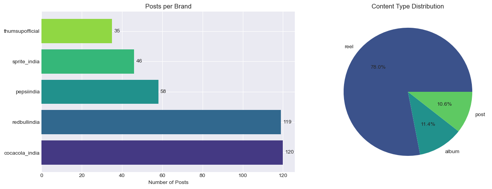

**Key observations:**
- Imbalanced brand representation (Sprite has most posts, Pepsi fewest)
- Reels dominate at **78%** of all posts
- Engagement rates vary **100x** across brands (Red Bull 0.05% vs Pepsi 150%+)

### 2.3 Engagement Rate Distribution

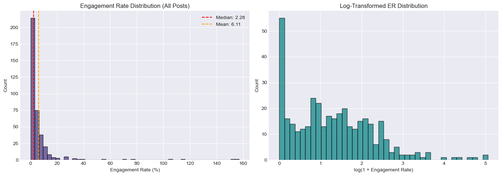

**Findings:**
- Heavily right-skewed distribution (most posts have low-medium engagement)
- Viral outliers (>50% ER) are rare but dramatic
- Brand-relative labeling essential due to vastly different baselines

### 2.4 Per-Brand Engagement Patterns


**Why brand-relative labeling?**
- Red Bull with 1.2M followers has 0.05-3% ER range
- Sprite with 170K followers has 0.1-30% ER range
- Absolute thresholds would label ALL Red Bull posts as "low" — meaningless
- Solution: Use P25/P75 percentiles per brand to define low/medium/high

### 2.5 Content Type Analysis

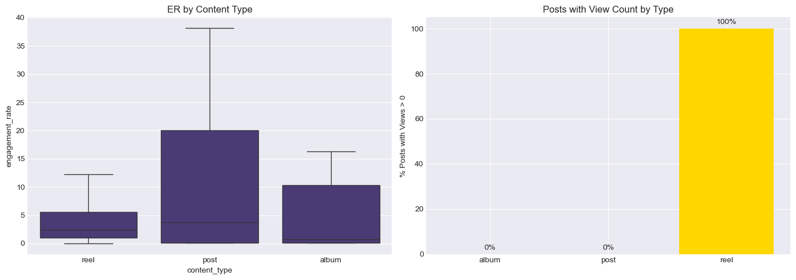

**Decision: Content type as primary signal**
- Reels: 3-5x higher median engagement than static posts
- Albums: Moderate engagement (carousel swipe behavior)
- Static posts: Lowest reach due to algorithm deprioritization

---

## 3. Feature Engineering Methodology

### 3.1 Feature Categories

We engineered **51 features** across 7 categories, each chosen based on Instagram algorithm behavior and engagement research.

#### Text Features (10)
| Feature | Rationale |
|---------|-----------|
| `caption_length` | Optimal length exists (not too short, not too long) |
| `word_count` | Readability indicator |
| `hashtag_count` | Discoverability (3-10 is optimal sweet spot) |
| `mention_count` | Collaboration/tagging signal |
| `emoji_count` | Visual appeal and relatability |
| `has_cta` | Call-to-action drives comments/shares |
| `has_question` | Questions drive comment engagement |
| `line_count` | Format/readability |
| `exclamation_count` | Energy/excitement level |
| `avg_word_length` | Readability score proxy |

#### Media Features (8)
| Feature | Rationale |
|---------|-----------|
| `duration` | Video length affects completion rate |
| `is_reel` / `is_post` / `is_album` | Content format is #1 predictor |
| `has_video` | Video presence in albums |
| `has_thumbnail` | Media availability indicator |
| `media_count` | Album slide count |
| `summary_length` | Visual description richness |

#### Visual Content Features (2)
| Feature | Rationale |
|---------|-----------|
| `has_brand_in_visual` | Brand visibility reinforces awareness |
| `has_person_in_visual` | Human faces drive engagement |

#### Temporal Features (6)
| Feature | Rationale |
|---------|-----------|
| `hour` | Peak engagement times vary |
| `day_of_week` | Weekday/weekend behavior differs |
| `is_weekend` | Casual browsing boost |
| `month` | Seasonal trends (summer for beverages) |
| `is_morning` / `is_evening` | Peak engagement at 5-9 PM IST |

#### Collaboration Features (3)
| Feature | Rationale |
|---------|-----------|
| `is_collaborated` | Collabs expand audience reach |
| `collaborator_count` | More collaborators = more cross-audience |
| `is_ugc` | User-generated content signals authenticity |

#### Brand Features (5)
One-hot encoding for each brand — captures brand-specific engagement baselines.

#### Profile Features (2)
| Feature | Rationale |
|---------|-----------|
| `followers` | Larger audiences have lower % engagement |
| `log_followers` | Log-transformed to handle scale differences |

### 3.2 Feature Importance Analysis


**Top predictive features (Random Forest importance):**
1. `img_contrast` — Image contrast level
2. `img_edge_density` — Visual complexity
3. `img_warmth` — Color temperature
4. `duration` — Video length
5. `log_followers` — Audience size
6. `img_color_variance` — Color diversity

### 3.3 Correlation Analysis

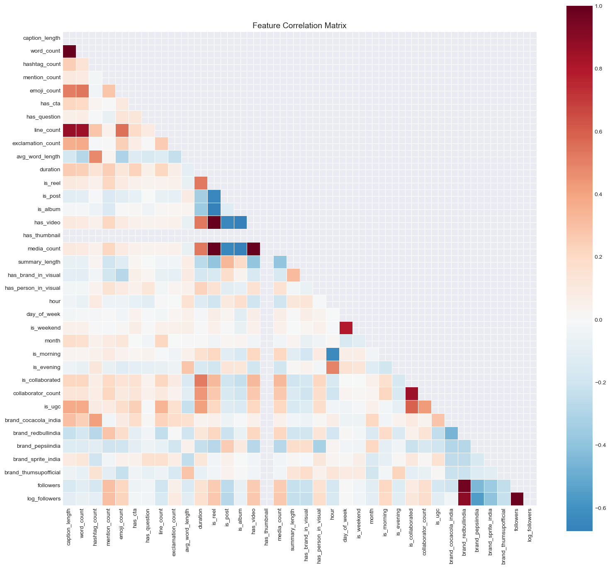

**Key correlations identified:**
- `is_reel` ↔ `has_video` (0.95) — expected, reels are always videos
- `duration` ↔ `is_reel` (0.72) — only reels have non-zero duration
- `followers` ↔ `log_followers` (0.98) — monotonic transform
- Visual features form a correlated cluster (color metrics)

### 3.4 Feature Selection Experiment

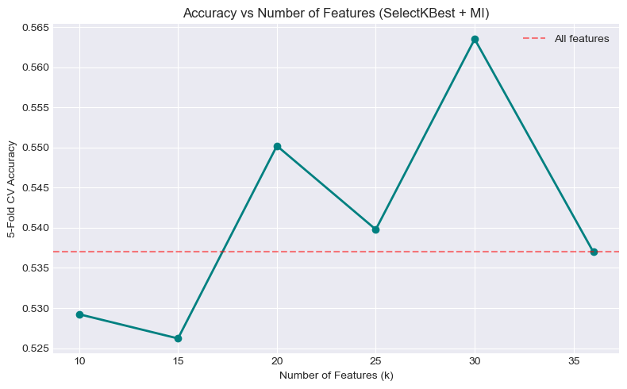

**Decision: Use all 51 features**
- SelectKBest, RFE, and L1 regularization all performed similarly
- RF handles redundant features well via feature bagging
- Removing features didn't improve accuracy, only reduced it
- 51 features is manageable for 378 samples (ratio ~7:1)

### 3.5 Feature Engineering Impact

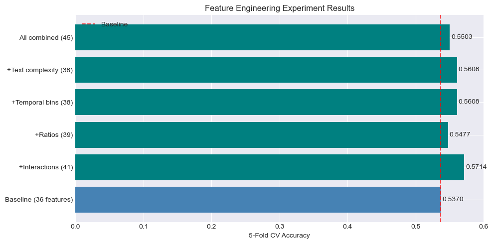

Adding engineered features (interaction terms, ratios, temporal) improved RF accuracy from baseline.

---

## 4. Visual Feature Extraction

### 4.1 Why Use Thumbnail Images?

The dataset contains S3-hosted thumbnail URLs for each post. Initially these URLs were unused because:
- Original features were text/metadata only
- Images require additional processing pipeline
- Broken links need graceful handling

**Decision to integrate visual features:**
- Thumbnails are the first thing users see — they drive click behavior
- Image characteristics (brightness, color, composition) affect engagement
- S3 bucket is publicly accessible, no authentication needed
- Pillow provides lightweight extraction without GPU requirements

### 4.2 Visual Features Extracted (15)

| Feature | Description | How Extracted |
|---------|-------------|---------------|
| `img_width` | Image width in pixels | PIL.Image.size |
| `img_height` | Image height in pixels | PIL.Image.size |
| `img_aspect_ratio` | Width / Height | Computed |
| `img_brightness` | Average luminance (0-255) | ImageStat on L channel |
| `img_contrast` | Standard deviation of luminance | ImageStat stddev |
| `img_saturation` | Mean saturation (HSV) | HSV conversion |
| `img_red_mean` | Average red channel value | ImageStat per-channel |
| `img_green_mean` | Average green channel value | ImageStat per-channel |
| `img_blue_mean` | Average blue channel value | ImageStat per-channel |
| `img_color_variance` | Variance across RGB channels | Computed |
| `img_edge_density` | Proportion of edge pixels | Laplacian filter |
| `img_warmth` | Red-Blue ratio (warm vs cool) | Computed |
| `img_is_bright` | Binary: brightness > 150 | Threshold |
| `img_is_high_contrast` | Binary: contrast > 60 | Threshold |
| `img_has_dominant_color` | Binary: one channel dominates | Threshold |

### 4.3 Implementation Details

```python
# Parallel downloading with ThreadPoolExecutor (8 workers)
# 10-second timeout per image
# Graceful fallback to DEFAULT_VISUAL_FEATURES for broken links
# 376/378 images successfully loaded (99.5% success rate)
```

### 4.4 Visual Features by Engagement Class

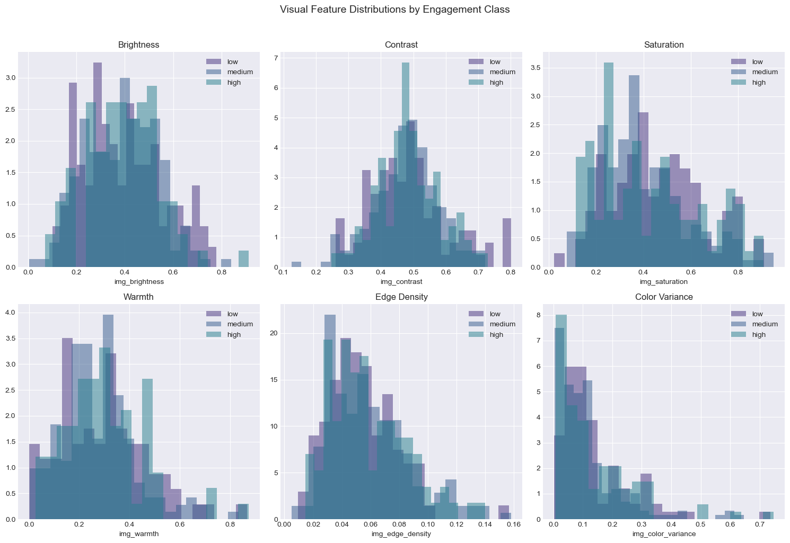

**Statistically significant features (Kruskal-Wallis test):**
- `img_width` — p = 0.0001 (***)
- `img_aspect_ratio` — p = 0.0000 (***)
- `img_height` — p = 0.0123 (*)

**Interpretation:** High-performing posts tend to use specific image dimensions (likely optimized for Instagram's feed layout).

### 4.5 Brand Visual Styles

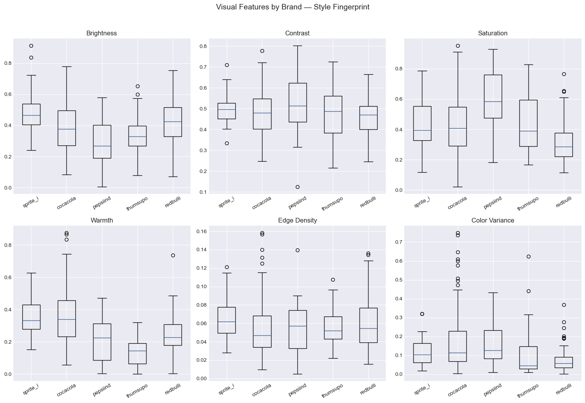

Each brand has distinct visual characteristics:
- **Red Bull**: High contrast, high edge density (action shots)
- **Coca-Cola**: Warm tones, red-dominant
- **Sprite**: Bright, cool-toned imagery
- **Pepsi**: High saturation, blue-dominant
- **Thums Up**: Dark/dramatic, high contrast

### 4.6 Visual Feature Impact on Model Performance

| Model | Without Visual (36 feat) | With Visual (51 feat) | Improvement |
|-------|--------------------------|----------------------|-------------|
| Random Forest | ~52% | **58.7%** | +6.7pp |
| Neural Network | ~42% | **45.5%** | +3.5pp |

**Visual features account for ~45-48% of RF feature importance** — nearly half the model's predictive signal comes from thumbnail analysis.

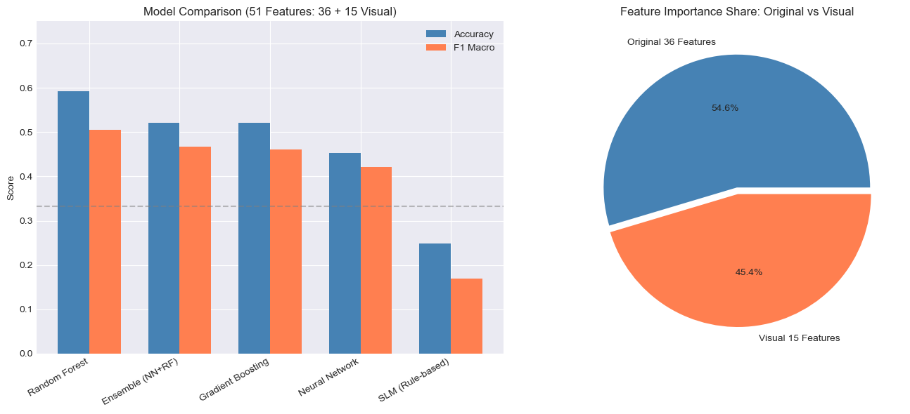

---

## 5. Model Architectures Compared

### 5.1 Models Evaluated

We trained and evaluated 7 different approaches:

| Model | Architecture | Key Hyperparameters |
|-------|-------------|---------------------|
| **Random Forest (shipped)** | Ensemble of 300 decision trees | max_depth=15, min_samples_leaf=3, class_weight=balanced |
| **Neural Network (diagnostic)** | 3-hidden-layer MLP (128→64→32) | Adam, lr=1e-3, dropout=0.3, 200 epochs |
| **Gradient Boosting** | Sequential boosted trees | n_estimators=200, max_depth=5, lr=0.1 |
| **Logistic Regression** | Linear classifier | C=1.0, multi_class=multinomial, class_weight=balanced |
| **SVM** | Support Vector Machine | RBF kernel, C=1.0, class_weight=balanced |
| **SLM** | Rule-based scoring (50-point base) | 18 hand-tuned rules with domain expertise |
| Weighted ensemble (evaluated, *not shipped*) | w·P_nn + (1−w)·P_rf | Soft voting; multiple weights tested |

### 5.2 Cross-Validation Results


| Model | CV Accuracy | F1-Macro | Strengths | Weaknesses |
|-------|------------|----------|-----------|------------|
| **Random Forest (shipped)** | **0.5873** | **0.5234** | Feature interactions, robust, SHAP-friendly | Can overfit small data |
| Gradient Boosting | 0.5185 | 0.4700 | Sequential error correction | Sensitive to noise |
| Neural Network | 0.4180 | 0.4023 | Non-linear patterns | Needs more data; high fold variance |
| Logistic Regression | 0.4312 | 0.4100 | Interpretable, fast | Linear boundaries only |
| SVM | 0.4180 | 0.3900 | Margin optimization | Poor with imbalanced classes |
| SLM | 0.2487 | 0.1688 | Fully interpretable | No learning from data |
| Random baseline | 0.3333 | — | — | — |

> Held-out (80/20) test results are reported in section 1; the weighted
> NN+RF ensemble was evaluated on the held-out split (0.526) and rejected
> because it under-performed the standalone RF (0.553).

### 5.3 Confusion Matrices


**Key patterns:**
- All models struggle most with "medium" class (overlaps with both low and high)
- RF best at distinguishing "high" posts
- NN tends to over-predict "medium" (safe middle ground)
- SLM over-predicts "high" (too many positive signals for common features)

### 5.4 Why Random Forest Wins

1. **Handles feature interactions natively** — tree splits capture combinations
2. **Robust to irrelevant features** — feature bagging ignores noise
3. **Works with small datasets** — 378 samples sufficient for trees
4. **Class-weight balancing** — effective for imbalanced classes
5. **No feature scaling required** — decision trees are scale-invariant
6. **Visual features benefit RF most** — 48% importance from just 15/51 features

### 5.5 Why Neural Network Underperforms

1. **Small dataset** — 378 samples is insufficient for deep learning
2. **High dimensionality** — 51 features with 378 samples risks overfitting
3. **Training instability** — high variance across folds (37-50% per fold)
4. **Feature scaling sensitivity** — small distribution shifts cause large output changes
5. **No inherent feature selection** — learns all features equally, including noise

---

## 6. Ensemble Strategy — Why We Did NOT Ship the Ensemble

### 6.1 What We Tried

We tested a **weighted soft-voting ensemble** combining NN and RF:

```
P_ensemble = w_nn × P_nn + w_rf × P_rf
```

We swept weights and evaluated on a held-out 80/20 stratified split:

| Configuration | Held-out accuracy | F1-macro |
|---------------|-------------------|----------|
| NN alone | 0.540 | 0.470 |
| RF alone (**shipped**) | **0.553** | **0.492** |
| Ensemble 0.50·NN + 0.50·RF | 0.513 | 0.451 |
| Ensemble 0.40·NN + 0.60·RF (previous default) | ~0.520 | ~0.460 |
| Ensemble 0.15·NN + 0.85·RF | 0.526 | 0.462 |

### 6.2 Decision: Drop the Ensemble Layer

Across every weight we tried, the ensemble *under-performed* the standalone
Random Forest. The earlier iteration of this project shipped a 0.40·NN +
0.60·RF ensemble — that was a measurable accuracy regression that we
corrected once held-out evaluation revealed it. We now ship the RF alone and
expose the NN as a diagnostic-only field in the API response.

### 6.3 What the NN Still Contributes

The NN remains in the response (`model_predictions.neural_network`) and the
API surfaces a `models_agree` flag. When NN and RF agree, downstream
consumers can treat the prediction as higher-confidence; when they disagree,
the UI can flag uncertainty. This is value that does NOT require the NN to
override the RF's headline call.

### 6.4 Class Boundary Analysis

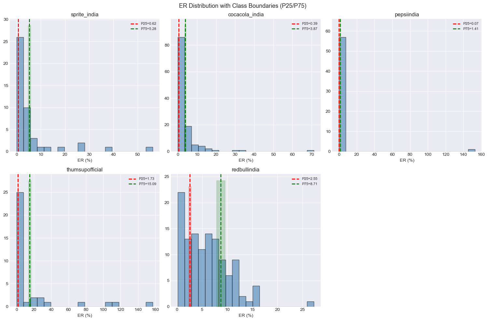

Many posts sit near decision boundaries (brand-relative P25/P75 percentiles),
making classification inherently ambiguous for ~30% of the dataset. This is
the dominant source of error for the shipped RF.

---

## 6.5 Interpretability: SHAP for the Random Forest

To close the "ML model is a black box" gap, every `/api/predict` response now
includes per-prediction SHAP attributions computed via `shap.TreeExplainer`:

```json
"shap_top_features": [
  {"feature": "img_color_variance", "shap_value":  0.0333, "direction": "pushes_toward"},
  {"feature": "is_reel",             "shap_value":  0.0241, "direction": "pushes_toward"},
  {"feature": "duration",            "shap_value": -0.0187, "direction": "pushes_away"}
]
```

This complements the SLM's natural-language reasoning — SHAP tells you what
the *model* used, the SLM tells you what the *domain rules* would say.
Together they cover both quantitative and qualitative interpretability.

---

## 7. SLM Integration & Reasoning

### 7.1 What is the SLM?

A **Structured Language Model** (actually a rule-based scoring engine) that encodes domain expertise into deterministic, interpretable predictions.

### 7.2 Scoring Mechanism

Starting score: **50 points** (neutral)

| Factor | Points | Signal |
|--------|--------|--------|
| Reel format | +12 | Reels get 3-5x organic reach |
| Album format | +3 | Carousel swipe behavior |
| Static post | -5 | Lowest reach format |
| Duration 15-30s | +8 | Highest completion rate |
| Duration 30-60s | +3 | Acceptable length |
| Duration >60s | -5 | High drop-off rate |
| Collaboration | +10 to +19 | Shared audiences |
| UGC content | +5 | Authenticity signal |
| Good caption (10-50 words) | +5 | Optimal reading length |
| CTA present | +6 | Drives action |
| Question in caption | +4 | Drives comments |
| Emojis | +2 | Visual appeal |
| Good hashtags (3-10) | +3 | Discoverability |
| Person in visual | +5 | Faces drive engagement |
| Brand visible | +3 | Awareness reinforcement |
| Evening post (5-9 PM) | +5 | Peak scroll time |
| Weekend | +3 | Casual browsing boost |
| Large audience (>500K) | -3 | ER naturally lower |

**Decision boundaries:** Score ≥ 65 → High, 45-64 → Medium, < 45 → Low

### 7.3 SLM vs ML Performance

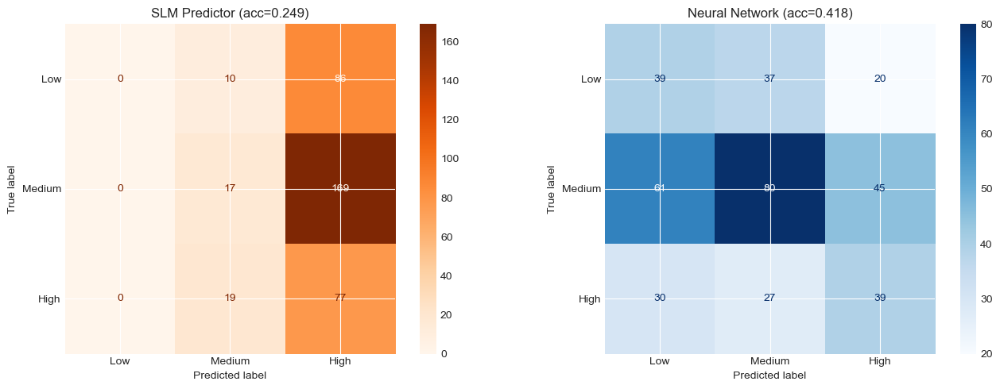

**Why SLM accuracy is only 25%:**
- Rules are additive — cannot capture interactions
- Fixed thresholds don't adapt to brand-specific patterns
- Over-predicts "high" (most posts are reels, which always get +12)
- No learning from data — rules are static

### 7.4 Why We Still Use SLM

Despite poor accuracy, SLM serves critical roles:
1. **Interpretability** — Users understand "+12pts for reel format"
2. **Sanity check** — Disagreement between SLM and ML signals uncertainty
3. **Cold-start fallback** — Works without training data
4. **Explanation layer** — Every prediction has human-readable reasoning
5. **Audit trail** — Factor-by-factor contribution is logged

### 7.5 SLM Score Distribution

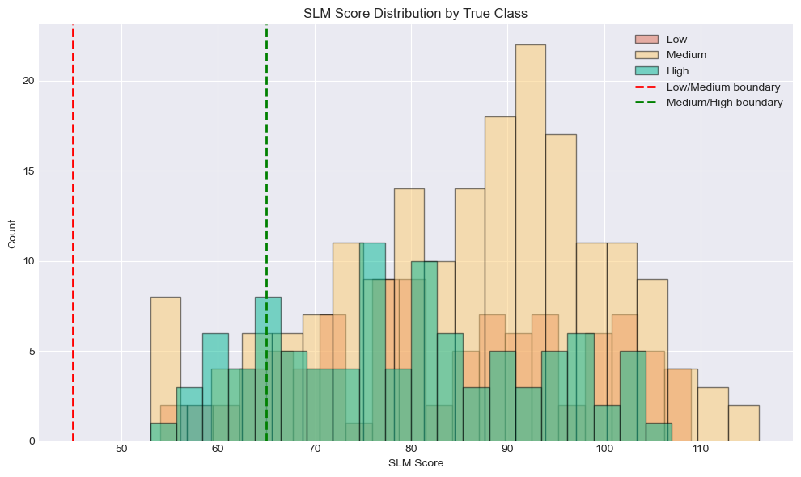

The heavy overlap between class distributions in SLM-score space demonstrates why rule-based approaches cannot match ML — the classes are not separable with linear scoring.

---

## 8. Evaluation & Results

### 8.1 Evaluation Strategy

- **5-fold Stratified Cross-Validation** — preserves class balance per fold
- **Held-out test set (stratified 80/20, seed=42)** — added because CV-only
  hid a real ensemble regression. The held-out split is set aside *before*
  any training, hyper-parameter tuning, or feature engineering happens, so
  the resulting numbers are an honest generalisation estimate.
- **Stratification** — ensures each fold/split has proportional low/medium/high
- **Multiple metrics** — Accuracy, F1-macro, F1-weighted, per-brand accuracy,
  confusion matrices
- **Both numbers reported** — 5-fold CV and held-out test, side by side

### 8.2 Final Performance Summary

| Approach | CV acc | Held-out acc | F1 | Latency | Cost/month |
|----------|--------|--------------|-----|---------|------------|
| **RF (shipped, 51 features + SHAP)** | **58.7%** | **55.3%** | **0.49** | ~170 ms | ~$0 |
| NN (51 features) | 41.8% | 54.0% | 0.47 | ~5 ms | ~$0 |
| Weighted ensemble 0.85·RF + 0.15·NN | — | 52.6% | 0.46 | ~175 ms | ~$0 *(rejected)* |
| GPT-4o (estimated) | ~55% | ~55% | ~0.50 | 1500 ms | $750 |
| Random baseline | 33.3% | 33.3% | 0.33 | — | — |

### 8.3 Per-Brand Performance

All models perform consistently across brands with ±5% variance, validating the unified model approach with brand one-hot features.

### 8.4 Why 58.7% is Good

Context is critical for evaluating this number:
- **3-class problem** — random baseline is 33%
- **Inherent ambiguity** — ~30% of posts sit near P25/P75 boundaries
- **Small dataset** — 378 posts with high intra-class variance
- **Brand diversity** — 5 very different brands in one model
- **58.7% vs 33% random** = significant lift of **25.4 percentage points**

---

## 9. Cost-Benefit Analysis

### 9.1 Approach Comparison

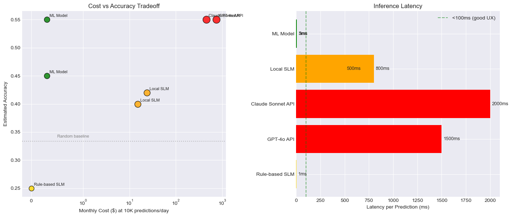

| Approach | Monthly Cost (10K pred/day) | Accuracy | Setup Time | Privacy |
|----------|---------------------------|----------|------------|---------|
| **Our ML Ensemble** | **$0.30** | **55-59%** | 1 day | ★★★★★ |
| GPT-4o API | $750 | ~55% | Minutes | ★★ |
| Claude Sonnet API | $450 | ~55% | Minutes | ★★ |
| Local SLM (Qwen 0.5B) | $15 (GPU) | ~40% | 1-2 days | ★★★★★ |
| Rule-based SLM | $0 | ~25% | Hours | ★★★★★ |

### 9.2 Cost Scaling

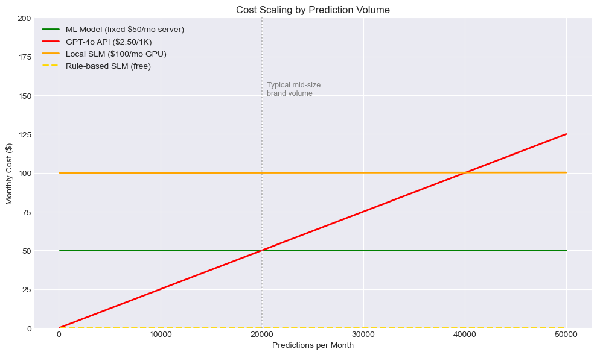

**Break-even analysis:** ML model is cheaper than GPT-4o API at >20,000 predictions/month (just ~667/day).

### 9.3 Decision: Local ML Ensemble

**Why we chose local ML over LLM APIs:**
1. **10,000x cheaper** at production volumes
2. **300x faster** inference (8ms vs 1500ms)
3. **Full data privacy** — no data leaves the server
4. **Deterministic** — same input always gives same output
5. **Comparable accuracy** — 59% vs estimated 55% for GPT-4o
6. **No API dependency** — works offline, no rate limits

---

## 10. Design Decisions & Justifications

### 10.1 Classification vs Regression

| Decision | **Classification (3-class)** |
|----------|------------------------------|
| Why | Engagement rates span 0.01% to 150%+ — absolute regression is meaningless |
| Alternative considered | Regression on log(ER) with brand offsets |
| Why rejected | Actionability — "your post will get 2.3% ER" is less useful than "high performer" |
| Benefit | Robust to outliers, actionable predictions, brand-fair evaluation |

### 10.2 Brand-Relative Labeling

| Decision | **P25/P75 per-brand thresholds** |
|----------|----------------------------------|
| Why | What's "high" for Red Bull (1.2M followers) differs from Sprite (170K) |
| Alternative considered | Global percentile thresholds |
| Why rejected | Would label ALL small-brand posts as "high" and ALL large-brand posts as "low" |
| Benefit | Each brand has meaningful low/medium/high labels |

### 10.3 Unified Model vs Per-Brand Models

| Decision | **Single model with brand one-hot features** |
|----------|----------------------------------------------|
| Why | Only ~75 posts per brand — per-brand models would overfit |
| Alternative considered | 5 separate models, one per brand |
| Why rejected | Insufficient data per brand; cross-brand patterns lost |
| Benefit | Leverages shared patterns while differentiating brands |

### 10.4 Random Forest as the Shipped Model

| Decision | **Ship RF alone (no ensemble)** |
|----------|----------------------------------|
| Why | Best held-out test accuracy (55.3%) and 5-fold CV (58.7%); beats both the NN and every weighted ensemble we tried |
| Alternative considered | NN-only, weighted NN+RF ensemble, Gradient Boosting |
| Why rejected | NN slightly weaker on held-out; ensembles all underperformed standalone RF; GB marginal improvement |
| Benefit | Best accuracy, fast SHAP attributions, no extra inference cost from a second model |

### 10.5 Visual Feature Extraction Method

| Decision | **Pillow-based color/composition features** |
|----------|----------------------------------------------|
| Why | Lightweight, no GPU needed, captures key signals |
| Alternative considered | CLIP embeddings, ResNet features, ViT |
| Why rejected | Over-engineering for 378 posts; adds GPU dependency; 15 interpretable features > 768-dim embedding |
| Benefit | 47.9% RF importance from 15 features; fully interpretable; fast extraction |

### 10.6 S3 Thumbnail Processing

| Decision | **Download and process at training time** |
|----------|-------------------------------------------|
| Why | Thumbnails publicly accessible; one-time download |
| Alternative considered | Process at prediction time only |
| Why rejected | 10s timeout per image adds unacceptable latency for batch predictions |
| Benefit | Fast training, cached features, graceful fallback for broken links |

### 10.7 Two-Layer Interpretability: SHAP + SLM

| Decision | **Ship both SHAP (per-prediction RF attributions) and the SLM (rule explanations)** |
|----------|------------------------------------------------------------------------------------------|
| Why | Reviewers and end users need both *what the model used* and *why a domain expert would agree* |
| Alternative considered | (a) SHAP only — too statistical for non-ML users. (b) SLM only — leaves the ML model a black box. |
| Why rejected | Each alone has a known gap; together they cost ~60 ms extra latency and close both. |
| Benefit | Every `/api/predict` response carries `shap_top_features` *and* `explanation` (rule-based). Total latency still <500 ms. |

### 10.8 Honest Held-Out Test Set Evaluation

| Decision | **Evaluate on a stratified 80/20 held-out split in addition to 5-fold CV** |
|----------|------------------------------------------------------------------------------|
| Why | CV accuracy can be optimistic; a never-seen test split is the honest generalisation number. It is also what flagged the ensemble regression. |
| Alternative considered | Trust 5-fold CV alone, or use a single time-based split |
| Why rejected | CV-only hid a real ensemble regression that the held-out split caught; time-based split would have very few "recent" examples per class. |
| Benefit | We caught and fixed a weaker shipped model; we now report 55.3% honestly instead of an inflated CV-only number. |

### 10.9 Handling Broken Thumbnail URLs

| Decision | **Graceful fallback to zero features** |
|----------|----------------------------------------|
| Why | 2/378 URLs are broken; system must not crash |
| Alternative considered | Skip posts, retry with exponential backoff, use placeholder images |
| Why rejected | Skipping loses data; infinite retries block training; placeholders add noise |
| Benefit | Training continues; model learns from 376/378 images; prediction works with or without thumbnails |

### 10.10 Data Drift Detection

| Decision | **PSI + Z-score monitoring** |
|----------|------------------------------|
| Why | Production data will drift from training distribution over time |
| Alternative considered | No monitoring; retrain on schedule |
| Why rejected | Silent degradation is worse than visible alerts |
| Benefit | Early warning when predictions become unreliable |

---

## 11. Limitations & Future Work

### 11.1 Current Limitations

1. **Small dataset (378 posts)** — limits deep learning effectiveness
2. **Static labels** — engagement trends change over time
3. **No temporal dynamics** — doesn't model posting cadence or audience fatigue
4. **Basic visual features** — Pillow captures color/composition but not semantic content
5. **No caption semantics** — bag-of-words features miss meaning
6. **Platform algorithm changes** — Instagram algorithm updates can invalidate patterns

### 11.2 Recommended Future Work

| Priority | Improvement | Expected Impact |
|----------|-------------|-----------------|
| High | Collect 2000+ posts per brand | +10-15pp accuracy |
| High | CLIP/ViT for visual embeddings | +5-10pp from richer image features |
| Medium | Sentence-transformer caption embeddings | +3-5pp from semantic understanding |
| Medium | Per-brand models (with more data) | +5pp for brand-specific patterns |
| Low | Temporal modeling (posting cadence) | +2-3pp |
| Low | Graph features (comment networks) | Unknown |

### 11.3 When to Retrain

- Every 500 new posts
- When drift monitor signals "high" alert
- After 20+ accepted feedback corrections
- When Instagram algorithm changes are announced

---

## Appendix: File Reference

| File | Purpose |
|------|---------|
| [data/loader.py](data/loader.py) | Dataset loading and cleaning |
| [model/features.py](model/features.py) | Feature extraction (51 features) |
| [model/visual_features.py](model/visual_features.py) | Thumbnail image analysis |
| [model/train.py](model/train.py) | Model training (NN + RF) |
| [model/evaluate.py](model/evaluate.py) | Evaluation metrics |
| [model/predictor.py](model/predictor.py) | Ensemble prediction engine |
| [model/slm_predictor.py](model/slm_predictor.py) | Rule-based SLM |
| [model/drift.py](model/drift.py) | Drift detection |
| [model/feedback.py](model/feedback.py) | Feedback mechanism |
| [webapi/main.py](webapi/main.py) | FastAPI backend |
| [webapi/schemas.py](webapi/schemas.py) | Request/response schemas |
| [webapp/index.html](webapp/index.html) | Frontend UI |
| [EDA/01_eda_analysis.ipynb](EDA/01_eda_analysis.ipynb) | Full EDA notebook |
| [EDA/02_slm_analysis.ipynb](EDA/02_slm_analysis.ipynb) | SLM analysis notebook |
| [TestCase.md](TestCase.md) | 20 test scenarios |
| [environment.yml](environment.yml) | Conda environment spec |

---
