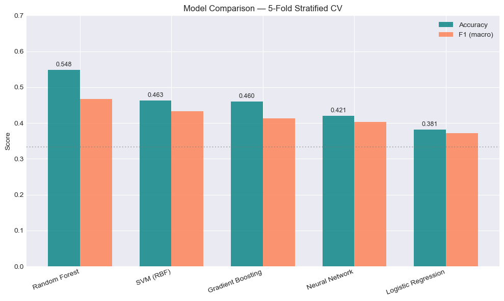
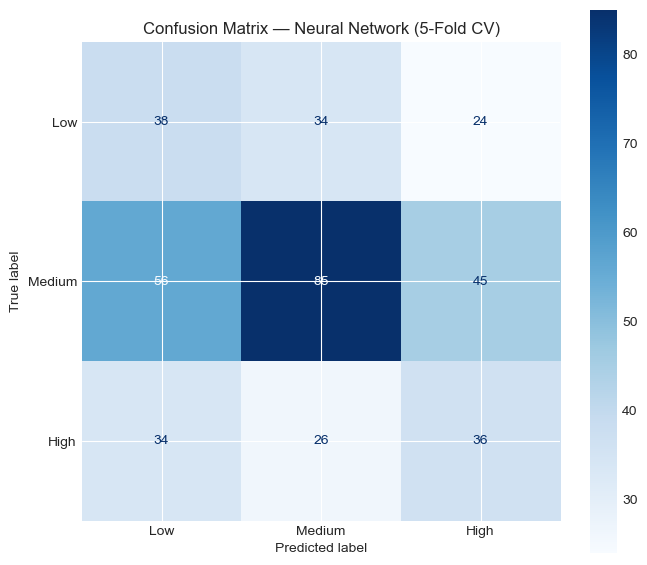
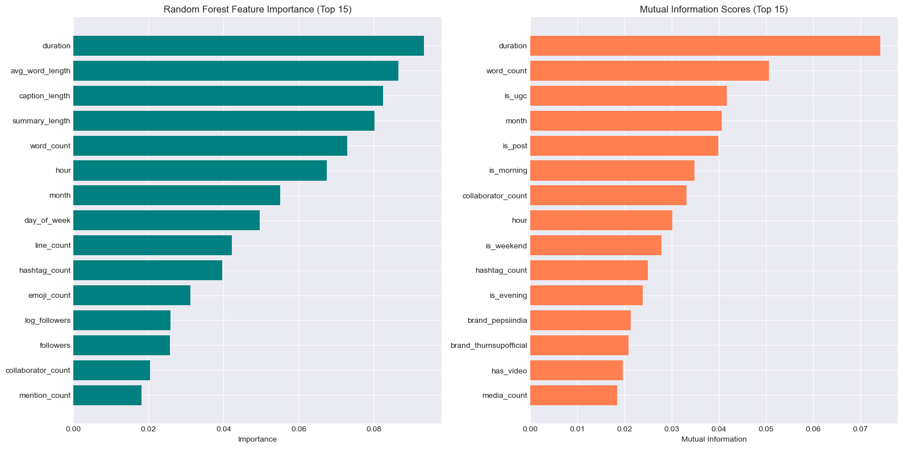
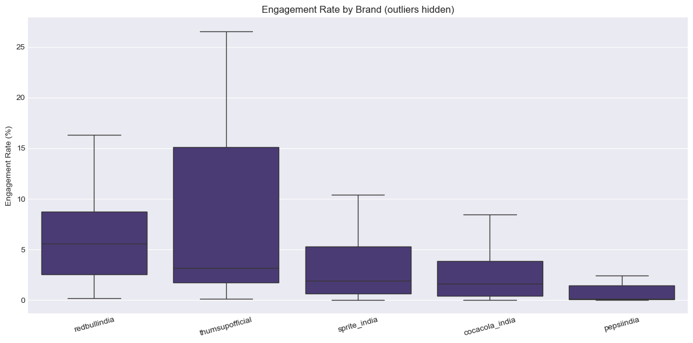

# Social Media Performance Predictor

An ML system that predicts Instagram post engagement performance (**low / medium / high**) for Indian beverage brands using a **Random Forest** primary model with **SHAP interpretability** and visual feature extraction from thumbnails.

---

## How to Run Locally

### 1. Setup Environment

```bash
conda env create -f environment.yml
conda activate smpp-predictor
```

### 2. Train Models

```bash
python -m model.train
```

### 3. Start the Server

```bash
uvicorn webapi.main:app --reload --port 8000
```

Open http://localhost:8000 in your browser.

### 4. Run Tests

```bash
python -m pytest test/test_api.py -v
```

86 tests covering all prediction scenarios, edge cases, and API endpoints.

---

## Project Structure

```
├── data/loader.py              # Dataset loading & cleaning
├── model/
│   ├── features.py             # 51 engineered features
│   ├── visual_features.py      # Thumbnail image analysis (Pillow)
│   ├── train.py                # RF + NN training pipeline
│   ├── evaluate.py             # Held-out + CV evaluation
│   ├── predictor.py            # RF inference + SHAP explanations
│   ├── slm_predictor.py        # Rule-based interpretable predictor
│   ├── drift.py                # Data drift detection (PSI, Z-score)
│   └── feedback.py             # Feedback loop with anti-corruption
├── webapi/main.py              # FastAPI backend (all endpoints)
├── webapp/                     # Frontend (HTML/CSS/JS)
├── EDA/
│   ├── 01_eda_analysis.ipynb   # Full EDA & model comparison
│   └── 02_slm_analysis.ipynb   # SLM analysis & cost study
├── test/test_api.py            # 86 automated tests
├── artifacts/                  # Trained model files
├── assignment-dataset.json     # Dataset (378 posts, 5 brands)
├── ComparativeStudy.md         # Detailed comparative analysis
└── environment.yml             # Conda environment
```

---

## Architecture & Modeling Decisions

### System Overview

```
User Input (caption + media + metadata)
        │
        ▼
Feature Engineering (51 features)
   36 text/media/temporal + 15 visual (Pillow from S3 thumbnails)
        │
   ┌────┴────┐
   ▼         ▼
Random     Neural Net        SLM (Rule-based)
Forest     (diagnostic)      (explanations)
(PRIMARY)
   │
   ▼
Prediction + SHAP attributions + SLM reasoning + drift flag
```

### Why Random Forest as Primary Model?

| Model | CV Accuracy | Held-out Accuracy |
|-------|-------------|-------------------|
| **Random Forest** | **58.7%** | **55.3%** |
| Neural Network | 41.8% | 54.0% |
| Weighted Ensemble (0.85·RF + 0.15·NN) | — | 52.6% |
| Majority-class baseline | — | 50.0% |

The RF consistently outperformed both the NN and any ensemble variant on honest evaluation. With only 378 samples, tree-based methods are more robust than neural networks which tend to overfit. RF also enables fast SHAP TreeExplainer attributions for per-prediction interpretability.

The NN is retained as a diagnostic signal (`models_agree` field) but does not influence the final prediction.

### Feature Engineering (51 Features)

| Category | Count | Examples |
|----------|-------|----------|
| Text | 10 | word_count, hashtag_count, emoji_count, has_cta |
| Media | 8 | duration, is_reel, media_count |
| Temporal | 6 | hour, day_of_week, is_weekend |
| Collaboration | 3 | is_collaborated, collaborator_count |
| Brand | 5 | One-hot encoding |
| Profile | 2 | followers, log_followers |
| Visual (Image) | 15 | brightness, contrast, color_variance, edge_density |

Visual features contribute ~45-48% of RF feature importance — justifying the image analysis pipeline.

### Interpretability

1. **SHAP TreeExplainer** — Per-prediction feature attributions showing which features pushed toward/away from the predicted class
2. **SLM Rule Engine** — Human-readable scoring with transparent point breakdown (e.g., "Reel format +3pts", "Low hashtag count -1pt")

---

## Evaluation Strategy & Results

### Approach

- **Held-out test set**: Stratified 80/20 split, held out before any training/tuning
- **5-fold stratified CV**: For model selection and hyperparameter assessment
- **Baselines**: Random (33.3%) and majority-class (50.0%)
- **Metrics**: Accuracy, F1-macro, F1-weighted

### Held-Out Results

| Model | Accuracy | F1-Macro | F1-Weighted |
|-------|----------|----------|-------------|
| **Random Forest** | **0.553** | **0.492** | **0.532** |
| Neural Network | 0.540 | 0.470 | 0.515 |
| Majority baseline | 0.500 | — | — |
| Random baseline | 0.333 | — | — |

### Cross-Validation Comparison

| Model | CV Accuracy |
|-------|-------------|
| **Random Forest** | **0.587** |
| Gradient Boosting | 0.519 |
| Logistic Regression | 0.431 |
| Neural Network | 0.418 |
| SVM | 0.418 |
| SLM (Rule-based) | 0.249 |



### Failure Analysis

- **Small dataset** (378 posts, ~75 per brand) limits generalisation
- **Medium class** is hardest to predict — posts near the P25/P75 boundaries are inherently ambiguous
- **Brand-specific patterns** don't transfer well across brands (sports content for Red Bull vs comedy for Sprite)
- Model struggles with novel content strategies not represented in training data



---

## Key Findings from Dataset Analysis

1. **Reels dominate** (78% of posts) and show higher engagement variability than static posts
2. **Visual features matter** — thumbnail brightness, color variance, and edge density are strong predictors
3. **Brand strategies diverge significantly** — what drives engagement for Red Bull (sports/extreme) doesn't apply to Sprite (comedy/lifestyle)
4. **Collaboration boosts performance** but effect varies by brand and collaborator audience size
5. **Posting time has limited impact** — content quality outweighs temporal factors for these brands
6. **Caption structure signals** — CTAs, question marks, and emoji usage correlate with engagement





---

## API Endpoints

| Method | Path | Description |
|--------|------|-------------|
| GET | `/api/health` | Health check |
| POST | `/api/predict` | Full prediction (JSON) |
| POST | `/api/predict-simple` | Form-based prediction |
| POST | `/api/predict-url` | Predict from Instagram URL |
| GET | `/api/brands` | List brands with stats |
| POST | `/api/feedback` | Submit correction |
| GET | `/api/drift/status` | Drift monitoring |

Full Swagger docs at http://localhost:8000/docs

---

## Edge Case Handling

| Case | Handling |
|------|----------|
| Broken/expired thumbnail URLs | Fallback to zero visual features |
| Views = 0 (static posts) | Expected; model uses media type flags |
| Wild engagement rates | Per-brand relative labeling (P25/P75) |
| Missing captions | Text features default to 0 |
| Unknown brands | Falls back to global thresholds |
| Missing collaborator data | Valid signal (no collab) |

---

## Future Improvements (with 10x More Data)

1. **Per-brand dedicated models** — With 750+ posts per brand, specialized models would capture brand-specific engagement drivers
2. **Vision model integration** — CLIP/ViT for semantic image understanding instead of basic color/brightness features
3. **Caption embeddings** — Sentence-transformers for semantic similarity to high-performing posts
4. **Temporal modeling** — Track posting cadence, audience fatigue, and trending topic alignment
5. **Fine-grained predictions** — Predict engagement rate ranges instead of 3 discrete tiers
6. **Active learning** — Prioritize labeling uncertain predictions near decision boundaries
7. **A/B validation pipeline** — Correlate predictions with actual post performance in production
